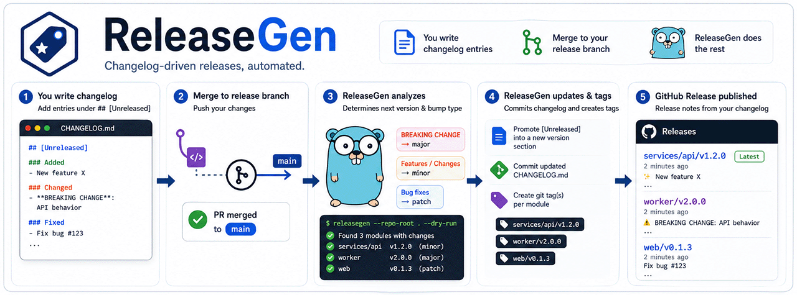
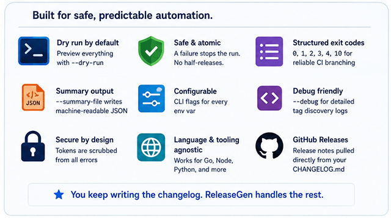
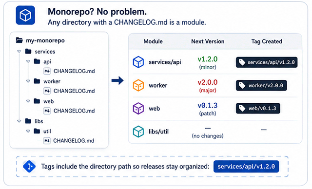

# ReleaseGen

> Turn the `CHANGELOG.md` you already maintain into versioned Git tags and GitHub Releases — automatically.

ReleaseGen is a small Go tool that reads your changelog and does the mechanical part of cutting a release for you. You write a normal [Keep a Changelog](https://keepachangelog.com/en/1.1.0/) entry under `## [Unreleased]`; when you merge to your release branch, ReleaseGen:

1. decides the next [SemVer](https://semver.org/spec/v2.0.0.html) version from the kinds of changes you listed,
2. promotes those notes into a new numbered section and commits it,
3. creates the matching Git tag, and
4. publishes a GitHub Release using your changelog notes as the body.

That's the whole job — no plugins, no runtime, no DSL, and it never inspects your source code.

## Table of Contents

- [Why ReleaseGen?](#why-releasegen)
- [Features](#features)
- [Quick Start](#quick-start)
- [How It Works](#how-it-works)
- [Writing Your `CHANGELOG.md`](#writing-your-changelogmd)
- [GitHub Actions Integration](#github-actions-integration)
- [Configuration](#configuration)
- [Building From Source](#building-from-source)
- [FAQ](#faq)
- [Contributing](#contributing)
- [License](#license)

## Why ReleaseGen?

Most release automation derives the version and notes from **commit messages** (Conventional Commits) or from special **intent files**. ReleaseGen takes the position that the changelog you already curate *is* the source of truth, and that the only thing standing between a merged PR and a published release is mechanical work a tool should do for you.

It's a good fit when you want:

- **Changelog-driven, not commit-driven.** Your `CHANGELOG.md` is the contract. You don't have to enforce Conventional Commits, squash policies, or commit linting across every contributor to get correct versions.
- **Language-agnostic monorepo releases.** A "module" is just any directory containing a `CHANGELOG.md`. Each gets its own independent version line and tag (e.g. `services/api/v1.2.3`). It works equally well for Go, Node, Python, or polyglot repos.
- **One small, auditable step.** A single static binary (or container image) that does exactly one thing and composes with whatever already builds and publishes your artifacts, rather than replacing it.
- **Safety by default.** `--dry-run` previews every decision, a bad module aborts the run instead of half-releasing, tokens are scrubbed from error output, and structured exit codes let CI branch on the failure class instead of grepping logs.

### How It Compares

| Tool | Decides version from | Monorepo model | Scope |
| ---- | -------------------- | -------------- | ----- |
| **ReleaseGen** | Curated `CHANGELOG.md` (Keep a Changelog) | Any dir with a changelog; per-module tags | Tag + GitHub Release only |
| semantic-release | Conventional Commit messages | Plugins / extra config | Versioning + publishing (Node-centric) |
| release-please | Conventional Commit messages | Release PRs per package | Release PR + tag + release |
| Changesets | Hand-written intent files (`.changeset/`) | First-class (JS/TS workspaces) | Versioning + publishing (JS-centric) |
| GoReleaser | Existing Git tags | N/A (builds artifacts) | Build + package + publish |

ReleaseGen deliberately does **not** build artifacts, publish to package registries, open PRs, or write your changelog for you. If you need those, run ReleaseGen for the version/tag/release step and pair it with your existing build tooling.

## Features



- **Automatic SemVer versioning.** The kinds of changes under `## [Unreleased]` decide whether the next version is a major, minor, or patch bump.
- **Monorepo support.** Discovers every `CHANGELOG.md` in the repo and releases each module independently with its own version line and tag.
- **GitHub Releases.** Creates the tag and a GitHub Release whose notes come straight from your changelog.
- **Dry-run previews.** `--dry-run` prints the next version and bump type without rewriting files, committing, pushing, tagging, or publishing.
- **Atomic, fail-fast runs.** A failing module aborts the run rather than leaving you half-released.
- **Structured exit codes.** Distinct codes for config, changelog, Git, and API failures so CI can branch on the failure class. See [Exit Codes](#exit-codes).
- **Machine-readable summaries.** `--summary-file` writes a JSON summary of the run for downstream steps to consume instead of scraping logs.
- **Config via flags or env.** Every environment variable has an equivalent CLI flag; flags take precedence over env, which takes precedence over built-in defaults.
- **Custom change types.** Map your own changelog headings (e.g. `Documentation`) to a specific bump level.
- **Debug logging.** `--debug` traces tag discovery and module-name extraction for troubleshooting.
- **Secure by default.** Bearer tokens are scrubbed from Git push errors before they reach the logs.
- **Structured logging.** `log/slog`-based output; under GitHub Actions it emits `::group::` / `::endgroup::` / `::error::` markers, and plain text locally.

## Quick Start

Install the CLI with Go:

```bash
go install github.com/c2fo/releasegen/cmd/releasegen@latest
```

…or pull the container image from GitHub Container Registry:

```bash
docker pull ghcr.io/c2fo/releasegen:latest
```

Preview what a release would do for your repo, without changing anything:

```bash
releasegen --dry-run \
  --repo-root . \
  --repository your-org/your-repo \
  --branch main \
  --actor "$USER" \
  --token "$GH_TOKEN"
```

When you're ready to automate it, drop the [example GitHub Actions workflow](#workflow-example) into `.github/workflows/`.

## How It Works

### Versioning Logic

ReleaseGen reads the entries under `## [Unreleased]` and applies the highest applicable bump:

| Bump | Triggered by |
| ---- | ------------ |
| **Major** | The exact phrase `BREAKING CHANGE` appears under a `### Changed` or `### Removed` section. |
| **Minor** | New features (`### Added`), `### Deprecated`, or `### Security` entries. |
| **Patch** | Only bug fixes (`### Fixed`). |

If `MANUAL_VERSION` (or `--manual-version`) is set, that value is used instead of the computed bump. When no tags exist yet, the repository is treated as starting from `v0.0.0`.

### Monorepo Support & Tag Naming



Any directory containing a `CHANGELOG.md` is treated as a module. ReleaseGen processes each one independently and only releases the modules whose `## [Unreleased]` section has new entries.

- **Root module** → the tag is `vX.Y.Z` (e.g. `v1.2.3`).
- **Nested module** → the tag is prefixed with the module's path (e.g. `worker/v2.3.4` or `services/api/v0.2.0`).

Prefixing tags with the directory path keeps releases organized and prevents collisions in larger repositories.

### Custom Change Types

Map additional changelog headings to a bump level with `CUSTOM_CHANGE_TYPES` (or `--custom-change-types`) using newline-separated `<heading>:<bump>` pairs, where `<bump>` is `major`, `minor`, or `patch`:

```yaml
CUSTOM_CHANGE_TYPES: |
  Documentation:minor
  Performance:patch
```

### Debug Mode

Set `DEBUG=true` (or pass `--debug`) to trace which tags are processed, the module names extracted from them, and which tags are added versus skipped — useful when tags aren't being detected as expected in a multi-module repo.

## Writing Your `CHANGELOG.md`

Your changelog must follow the [Keep a Changelog](https://keepachangelog.com/en/1.1.0/) format. ReleaseGen reads everything under `## [Unreleased]` to compute and cut the next release.

```markdown
# Changelog

All notable changes to this project will be documented in this file.

The format is based on [Keep a Changelog](https://keepachangelog.com/en/1.1.0/),
and this project adheres to [Semantic Versioning](https://semver.org/spec/v2.0.0.html).

## [Unreleased]

### Added
- New feature X.

### Changed
- **BREAKING CHANGE**: Changed API behavior in module Z.

### Deprecated
- Feature V is now deprecated.

### Removed
- **BREAKING CHANGE**: Removed support for the legacy API.

### Security
- Updated dependencies for security patches.

### Fixed
- Fixed bug related to issue #123.

## [v1.2.3] - 2024-08-09

### Added
- A previously released feature.
```

A few conventions keep parsing reliable:

1. **Use the standard headings** — `### Added`, `### Changed`, `### Removed`, `### Deprecated`, `### Security`, `### Fixed` (case-insensitive). Add your own via [custom change types](#custom-change-types).
2. **Mark breaking changes** with the exact phrase `BREAKING CHANGE`. This is the only thing that triggers a major bump, which guards against accidental major releases.
3. **Don't hand-edit version numbers.** Keep new entries under `## [Unreleased]` and let ReleaseGen promote them when you merge.

## GitHub Actions Integration

### GitHub App Setup (for branch protection)

If your release branch is protected (required reviews, status checks, etc.), the release commit and tag must come from an identity allowed to bypass those rules. The cleanest way is a dedicated GitHub App:

1. **Create a GitHub App** at `https://github.com/settings/apps` (personal) or `https://github.com/organizations/YOUR_ORG/settings/apps` (organization):
   - Click **New GitHub App**, give it a name (e.g. `releasegen-bot`), and set the Homepage URL to your repo.
   - Uncheck **Webhook → Active**.
   - Under **Repository permissions**, set **Contents: Read and write**.
   - Click **Create GitHub App** and note the **App ID**.
2. **Generate a private key** on the app settings page ("Private keys" → **Generate a private key**) and save the `.pem` file securely.
3. **Install the app** (left sidebar → **Install App**) on the repositories where you'll use ReleaseGen.
4. **Add repository secrets** (Settings → Secrets and variables → Actions):
   - `RELEASEGEN_APP_ID` = your App ID
   - `RELEASEGEN_APP_PRIVATE_KEY` = contents of the `.pem` file
5. **Allow the app to bypass branch protection.** How you do this depends on which protection style your release branch uses:
   - **Rulesets (recommended):** Settings → Rules → your release-branch ruleset → **Bypass list** → add the app. One list, done.
   - **Classic branch protection:** Settings → Branches → edit the rule for your release branch and update **two** separate lists:
     1. Under **Require a pull request before merging** → check **Allow specified actors to bypass required pull requests** → add the app.
     2. Under **Restrict who can push to matching branches** → add the app to the push allowlist.

   > **Heads up (classic protection):** the push allowlist alone is **not** enough. GitHub's docs are explicit: "People, teams, and apps that have permission to push to a protected branch will still need to create a pull request when pull requests are required." The push will fail with `protected branch hook declined` until the app is also in the pull-request bypass list. If you're on classic protection and want a single place to manage this, consider migrating the branch to a Ruleset.

   Repeat for every protected branch the workflow releases from (e.g. `main`, `v6`, etc.).

### Workflow Example

```yaml
name: Release by Changelog

on:
  push:
    branches:
      - main
  workflow_dispatch:
    inputs:
      branch:
        description: 'Branch to create a release from'
        required: true
        default: 'main'
      version:
        description: 'Specify the semantic version for the release (vX.Y.Z)'
        required: true
      reason:
        description: 'Reason for the manual release'
        required: false

jobs:
  release:
    runs-on: ubuntu-latest
    steps:
      - name: Generate GitHub App token
        id: generate-token
        uses: actions/create-github-app-token@v3
        with:
          app-id: ${{ secrets.RELEASEGEN_APP_ID }}
          private-key: ${{ secrets.RELEASEGEN_APP_PRIVATE_KEY }}

      - name: Checkout repository
        uses: actions/checkout@v6
        with:
          ref: ${{ github.event.inputs.branch || github.ref_name }}
          fetch-depth: 0
          token: ${{ steps.generate-token.outputs.token }}

      - name: Run ReleaseGen
        env:
          GITHUB_TOKEN: ${{ steps.generate-token.outputs.token }}
          GITHUB_REPOSITORY: ${{ github.repository }}
          GITHUB_ACTOR: ${{ github.actor }}
          GITHUB_REF_NAME: ${{ github.event.inputs.branch || github.ref_name }}
          MANUAL_VERSION: ${{ github.event.inputs.version || '' }}
          REASON: ${{ github.event.inputs.reason || '' }}
          # Optional: skip directories from changelog-based releases.
          EXCLUDE_DIRS: |
            some/app
            some/other/app
          # Optional: map custom headings to bump levels.
          CUSTOM_CHANGE_TYPES: |
            Documentation:minor
            Performance:patch
        run: |
          docker run --rm \
            -e GITHUB_TOKEN \
            -e GITHUB_REPOSITORY \
            -e GITHUB_ACTOR \
            -e GITHUB_REF_NAME \
            -e MANUAL_VERSION \
            -e REASON \
            -e EXCLUDE_DIRS \
            -e CUSTOM_CHANGE_TYPES \
            -v "$(pwd):/workspace" \
            ghcr.io/c2fo/releasegen:latest \
            --repo-root /workspace
```

> The image entrypoint is `/usr/local/bin/release-gen`, so anything after the image name is passed straight to the CLI. Add `--dry-run` to preview without publishing, or `--summary-file /workspace/release-summary.json` to capture a machine-readable result.
>
> The example uses readable version tags for clarity. For production, pin actions to a commit SHA.

### Manual Releases

To cut a release on demand (for example, from a non-default branch or to force a specific version):

1. Open **Actions** → **Release by Changelog** → **Run workflow**.
2. Choose the branch, optionally set a version and a reason, and run it.

The `version` input maps to `MANUAL_VERSION` and `reason` to `REASON`; the reason is appended to the changelog footer so the manual bump is recorded.

## Configuration

Every option can be set by environment variable or CLI flag. **Flags override environment variables, which override built-in defaults.**

| Environment Variable | CLI Flag | Required | Description |
| -------------------- | -------- | :------: | ----------- |
| `GITHUB_TOKEN` | `--token` | ✓ | Token used to push commits/tags and create releases. |
| `GITHUB_REPOSITORY` | `--repository` | ✓ | Repository in `<owner>/<repo>` form. |
| `GITHUB_ACTOR` | `--actor` | ✓ | User the release commit is attributed to. |
| `GITHUB_REF_NAME` | `--branch` | ✓ | Branch to release from. |
| `MANUAL_VERSION` | `--manual-version` | | Force a specific SemVer instead of computing the bump. Rejected if not valid semver. |
| `REASON` | `--reason` | | Note appended to the changelog footer for a manual release. |
| `EXCLUDE_DIRS` | `--exclude-dirs` | | Newline-separated directories to skip during discovery. |
| `CUSTOM_CHANGE_TYPES` | `--custom-change-types` | | Newline-separated `<heading>:<bump>` pairs. |
| `REPO_ROOT` | `--repo-root` | | Path to the Git working tree (default `.`). |
| `SUMMARY_FILE` | `--summary-file` | | Write a JSON summary of the run to this path. |
| `DEBUG` | `--debug` | | Verbose tag/discovery diagnostics. |
| — | `--dry-run` | | Compute and print actions without writing anything. |
| — | `--version` | | Print the build version and exit. |

> **Advanced:** `RELEASEGEN_SELF_MODULE` / `RELEASEGEN_SELF_REPO` control the "ReleaseGen releasing itself" case, in which the resolved version is printed to stdout for downstream steps. `RELEASEGEN_SELF_MODULE` is the module path relative to the repo root (defaults to empty, i.e. the root module) and `RELEASEGEN_SELF_REPO` defaults to `c2fo/releasegen`. The feature only triggers when `RELEASEGEN_SELF_REPO` matches the repository being released; set it to empty to disable. You only need these if you fork ReleaseGen.

### Exit Codes

When a run fails, the failure is logged with a `::error::` marker, no further modules are released, and the process exits non-zero with a code that tells you which layer failed:

| Code | Meaning |
| ---- | ------- |
| `0` | Success, or nothing to release. |
| `1` | Configuration error (missing/invalid input). |
| `2` | Changelog validation error (malformed `[Unreleased]`, unknown change type, incomplete `BREAKING CHANGE`). |
| `3` | Git error (push, tag, commit, etc.). |
| `4` | GitHub API error (release creation). |
| `10` | Internal error (a bug — please file an issue). |

Tags or releases written before a mid-run failure are **not** rolled back. Fix the failing module, push a new commit, and rerun.

## Building From Source

```bash
go build -ldflags "-X main.version=$(git describe --tags --always)" -o release-gen ./cmd/releasegen
./release-gen --help

# Preview a release against another checkout without writing anything:
./release-gen --dry-run \
  --repo-root /path/to/your/repo \
  --repository your-org/your-repo \
  --branch main \
  --actor you \
  --token "$GH_TOKEN"
```

## FAQ

**What happens when no tags exist yet?**
ReleaseGen treats the repository as starting at `v0.0.0` and creates the first tag from the entries under `## [Unreleased]`.

**What if there are no changes under `## [Unreleased]`?**
No release is created. ReleaseGen only acts when it finds valid entries to promote.

**Will a major bump update my `go.mod` for me?**
No. If a Go major version requires a module path change, you must update `go.mod` yourself.

**Can I exclude certain directories?**
Yes — set `EXCLUDE_DIRS` (or `--exclude-dirs`) to the directories you want to skip.

**Why does a monorepo tag include the directory path?**
Prefixing tags (e.g. `services/api/v1.2.3`) keeps releases organized and prevents collisions across modules.

**Can I trigger a release from a specific branch?**
Yes — use the `workflow_dispatch` trigger shown in the [workflow example](#workflow-example) and pick the branch.

**Can I advance to a specific version?**
Yes — set `MANUAL_VERSION` (or `--manual-version`, or the `version` workflow input). The value must be valid semver or the run exits with code `1`.

**Can I customize the versioning logic?**
Yes — beyond the standard Keep a Changelog headings, define your own with [custom change types](#custom-change-types).

## Contributing

Bug reports, feature requests, and pull requests are welcome. Please open an issue or submit a PR.

## License

ReleaseGen is licensed under the MIT License. See [`LICENSE.md`](LICENSE.md) for details.
